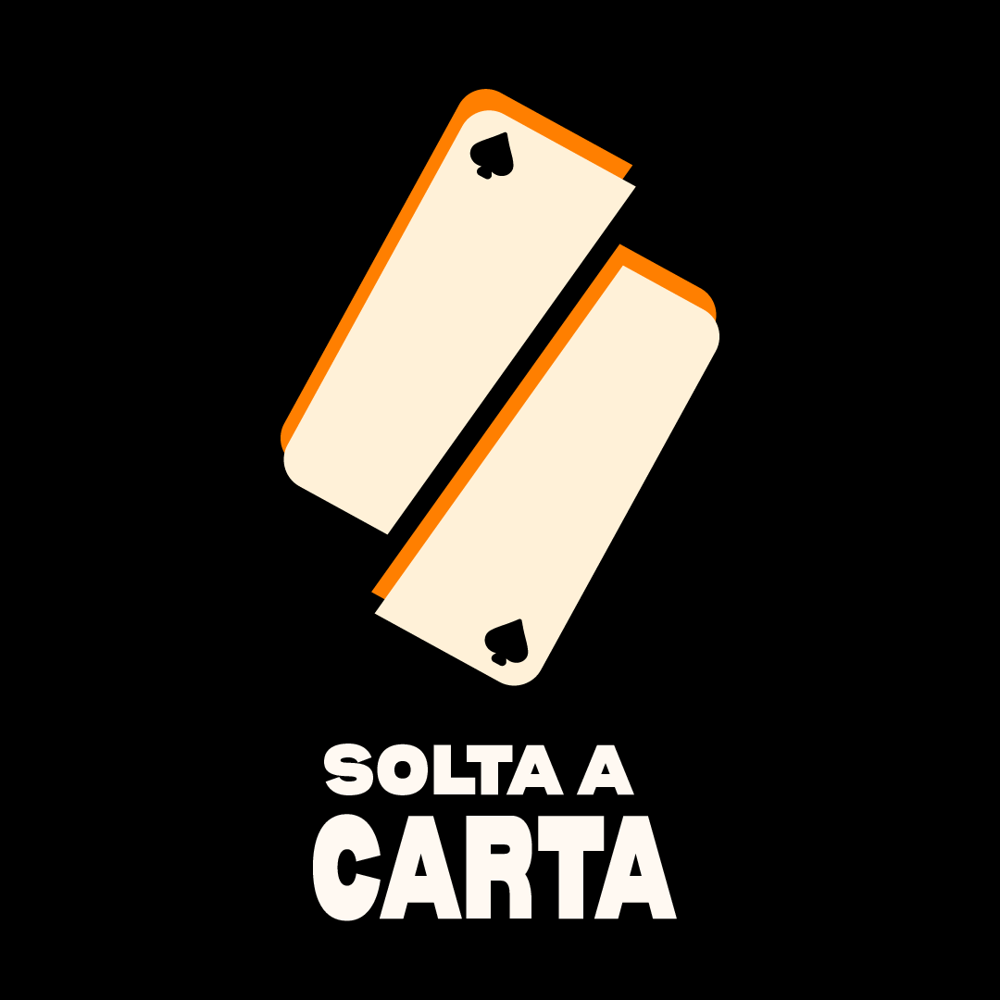

<div align="center">



# ♠ Solta a Carta ♦

### Virando o jogo contra as casas de aposta.

Movimento sem fins lucrativos de prevenção e conscientização sobre a **ludopatia**, o vício em apostas e jogos de azar.

[](https://lbsetti.github.io/solta-a-carta/)


</div>

---

## 📖 Sobre o projeto

O **Solta a Carta** é um site de conscientização feito para jovens, famílias e qualquer pessoa que queira entender o que está em jogo quando o assunto é aposta online no Brasil.

O movimento nasceu em setembro de 2026, motivado pela velocidade com que as casas de apostas (bets) e os cassinos online se espalharam pelo país. Antes de escrever qualquer conteúdo, a equipe fez uma **escuta ativa com o grupo Jogadores Anônimos**, sem gravar nomes, rostos ou dados que identifiquem alguém. Os dados do site foram cruzados com o que foi ouvido nessa pesquisa de campo.

**Objetivo:** reduzir a influência das casas de apostas informando e conscientizando a sociedade, em especial estudantes e adolescentes, que são o principal alvo da indústria.

> ⚠️ O Solta a Carta é um projeto de conscientização e **não substitui atendimento profissional**.

---

## 🌐 Acesso

O site é publicado com **GitHub Pages** e pode ser acessado em:

###  [](https://lbsetti.github.io/solta-a-carta/)

| Página | Endereço |
| --- | --- |
| Home | https://lbsetti.github.io/solta-a-carta/ |
| ♠ Dados que assustam | https://lbsetti.github.io/solta-a-carta/dados-que-assustam.html |
| ♦ O que é Ludopatia? | https://lbsetti.github.io/solta-a-carta/o-que-e-ludopatia.html |
| ♥ Apoio & Ajuda | https://lbsetti.github.io/solta-a-carta/apoio-e-ajuda.html |
| ♣ Confira nossas ações | https://lbsetti.github.io/solta-a-carta/trevos.html |
| Política de Privacidade | https://lbsetti.github.io/solta-a-carta/privacidade.html |

---

## 🃏 Estrutura do site: o baralho

A navegação segue a metáfora de um baralho: cada naipe é uma seção, e o coringa é a chamada para agir.

| Naipe | Página | O que você encontra |
| --- | --- | --- |
| ♠ **Espadas** | Dados que assustam | Linha do tempo das apostas no Brasil (2018–2026) com cartas que viram, panorama atual, índice de risco da FECAP, a "engenharia do quase ganho" e as 4 frentes de apostas (digital e físico, regulamentado e clandestino). |
| ♦ **Ouros** | O que é Ludopatia? | Evolução do diagnóstico (DSM-III → DSM-5 → CID-11), os 9 sinais de atenção, ilusão de controle, design que prende, fatores de risco e um jogo de "mitos x realidade" com moeda interativa. |
| ♥ **Copas** | Apoio & Ajuda | Autoavaliação com as 9 perguntas do DSM-5, como apoiar alguém que você ama, autoexclusão oficial, dicas práticas, rede de apoio e relatos anônimos. |
| ♣ **Paus (Trevos)** | Confira nossas ações | Ações, notícias, Portal de Transparência, quadro de Valetes (embaixadores) e Reis e Rainhas (apoiadores). |
| 🃏 **Coringa** | Apoie o movimento | Chamada para apoio e financiamento do movimento. |

### Destaques da home

- Vídeo institucional do movimento em formato de carta.
- Definição de **ludopatia** e os principais números do problema no Brasil.
- Bloco "Quem é o jogador no Brasil?" para combater o estigma.
- Missão do movimento e botão de **compartilhar**.
- Caixa "Precisa de ajuda agora?" no rodapé de todas as páginas.

---

## 🛟 Precisa de ajuda agora?

| Serviço | Contato |
| --- | --- |
| **Jogadores Anônimos** | [+55 41 9893-6054](tel:+554198936054) · [jogadoresanonimos.com.br](https://jogadoresanonimos.com.br) |
| **CVV** (apoio emocional 24h, gratuito e sigiloso) | Ligue **188** · [cvv.org.br](https://cvv.org.br) |
| **SUS** (atendimento gratuito, autoavaliação no Meu SUS Digital) | [Saiba mais](https://www.gov.br/saude/pt-br/assuntos/noticias-ms/2026/julho/campanha-do-ministerio-da-saude-orienta-sobre-riscos-das-apostas-online-e-atendimento-em-saude-mental-no-sus) |

O governo federal também oferece uma ferramenta oficial e gratuita de **autoexclusão** das casas de apostas regulamentadas, acessível com a conta gov.br.

---

## 🗂️ Estrutura do repositório

```
solta-a-carta/
├── index.html                # Home
├── dados-que-assustam.html   # ♠ Dados e linha do tempo
├── o-que-e-ludopatia.html    # ♦ Conceito, sinais, riscos e mitos
├── apoio-e-ajuda.html        # ♥ Autoavaliação, apoio e relatos
├── trevos.html               # ♣ Ações, notícias, transparência e apoiadores
├── privacidade.html          # Política de Privacidade
└── assets/
    ├── css/style.css         # Estilos do site
    ├── js/main.js            # Interações (menu, cartas, compartilhamento etc.)
    ├── fonts/                # Bernoru, NF Ananias e Luciole
    ├── img/                  # Logos e imagens
    └── video/                # Vídeo institucional (MOT_SOLTA_A_CARTA.mp4)
```

---

## 🛠️ Tecnologias

Site **estático**, sem build, sem framework e sem dependências:

- **HTML5** semântico, com `lang="pt-BR"`.
- **CSS3** em uma única folha de estilos.
- **JavaScript** puro (*vanilla*), carregado com `defer`.
- **SVG inline** (sprite) para naipes, coringa e ícones.
- **Fontes locais** (Bernoru, NF Ananias e Luciole), pré-carregadas com `preload`.
- **GitHub Pages** para hospedagem.

### Acessibilidade e experiência

- Link "Pular para o conteúdo" em todas as páginas.
- Uso de `aria-label`, `aria-hidden` e `aria-live` onde faz sentido.
- Layout responsivo, com comportamento específico para toque no menu mobile (o primeiro toque mostra o rótulo, o segundo navega).
- Cartas interativas que viram com mouse ou toque.

---

## ☁️ Publicação (GitHub Pages)

1. No repositório, vá em **Settings → Pages**.
2. Em **Build and deployment → Source**, escolha **Deploy from a branch**.
3. Selecione a branch **`main`** e a pasta **`/ (root)`**.
4. Salve. Em alguns instantes o site estará no ar em `https://lbsetti.github.io/solta-a-carta/`.

Todos os links internos são relativos, então o site funciona tanto na raiz quanto no subcaminho `/solta-a-carta/`.

---

## 🔒 Privacidade

- Relatos enviados em **Apoio & Ajuda** são tratados como **anônimos por padrão**. Não publicamos nome, imagem, contato ou qualquer detalhe que identifique quem enviou.
- **Não vendemos, alugamos nem compartilhamos dados pessoais.**
- Informações sensíveis são usadas apenas para os fins da causa e nunca divulgadas sem consentimento explícito.

Leia a política completa em [privacidade.html](https://lbsetti.github.io/solta-a-carta/privacidade.html).

---

## 🤝 Como apoiar

O movimento ainda não tem patrocínio nem verba de mídia, então o alcance depende de quem já conhece a causa.

- 📣 **Compartilhe** o site com amigos e família.
- 📲 **Siga** o movimento nas redes.
- 💚 **Financie** o movimento: parte do que for arrecadado vai para mídia paga voltada ao público jovem, e um **Portal de Transparência** vai prestar contas mês a mês.
- 🃏 **Seja um Valete:** marcas e figuras públicas podem virar embaixadores da causa. Escreva para o e-mail abaixo.
- 🏫 **Próxima meta:** levar palestras para escolas, com pais, professores e apoio técnico de psicólogos, psiquiatras e educadores.

---

## 📬 Contato e redes

| Canal | Link |
| --- | --- |
| Instagram | [@projetosoltaacarta](https://www.instagram.com/projetosoltaacarta/) |
| Facebook | [Solta a Carta](https://www.facebook.com/profile.php?id=61594390811809) |
| E-mail (imprensa e parcerias) | [projetosoltaacarta@gmail.com](mailto:projetosoltaacarta@gmail.com?subject=Imprensa%20e%20parcerias) |
| Linktree | [linktr.ee/projetosoltaacarta](https://linktr.ee/projetosoltaacarta) |

---

## 📚 Fontes dos dados

O conteúdo do site cita suas fontes em cada bloco. Entre as principais: Datafolha, Yogonet Brasil, FECAP, Instituto Locomotiva, FecomercioSP, Comscore, Observatório Brasileiro de Informações sobre Drogas (OBID), Unicef, Ministério da Saúde, Ministério da Fazenda, Banco Central, Itaú Unibanco, APA (DSM-III e DSM-5) e OMS (CID-11). Os números refletem o momento da publicação (setembro de 2026) e podem mudar.

---

## 📄 Licença

Este repositório ainda não define uma licença. Até que uma seja adicionada, todos os direitos sobre textos, marca, imagens e vídeo pertencem ao Movimento Solta a Carta. Para reutilizar qualquer material, entre em contato pelo e-mail acima.

---

<div align="center">

**♠ ♦ ♥ ♣**

*O jogo não será virado sozinho. Solta a carta!*

</div>
